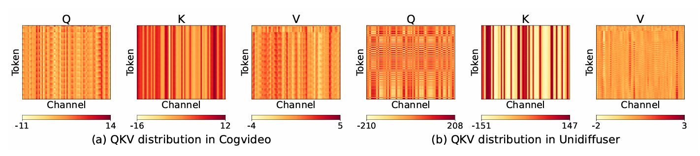

# RheoServe: A Heterogeneous Acceleration Engine for Sparse Attention Models

# Introduction

Large Language Models has deeply integrated into our daily life, and its capability keeps growing following the scalaing law. 

Although the scaling law slows down on models size and pretrained scale, a new trend of scaling: test time scaling /compute time scaling becames a spotlight. Encoupled with reinformcement learning,  The new scaling method encourages LLM to discover more possibilities though its own chain of thoughts. As a result, the context length requirement keeps growing, from 4k to 16k, 32k, and even 128k. KV Cache technology, which stores the key and value vectors of past tokens to avoid redundant computation, becomes a critical bottleneck for LLM serving systems. However, the KV cache size grows linearly with the context length, leading to significant memory consumption and bandwidth requirements. 

Recent works [] founds that the attention mechanism in LLMs exhibits inherent sparsity, where only a small subset of tokens significantly influence the generation of new tokens. Therefore, holding and computing the entire KV cache is often unnecessary.  

Dynamic Sparse Attention(DSA) Algorithems  [quest, MagicPIG, hashattention, seerattention, DSA,]  identifies and utilizes only the most critical tokens (top-K) for attention computation, which significantly reduce the Attention computational overhead. However, these methods still keeping the entire KV cache in GPU memory, witch quickly exhausts the memory capacity when dealing with long sequences. 

Researches [H20, StreamingLLM] manages a fixed cache budget by dropping less important tokens forever. However, these approachs performs poorly, enducing context drift and accuracy degradation during long-context inference. as they risks losing critical information which is reqired at certain generation stage. 

Thus, recent studies [sparseserve] opt for offloading non-critical KV entries to CPU memory, retrieving necessary entries back to GPU based on importance estimation. While this approach assures accuracy, its performance is closely restricted by the PCIe bandwidth. Thus, works [magicpic, hgca] opt to split the attention workload on both CPU and GPU through Log-Sum-Exp (LSE) softmax, alliviating the transfer bottleneck, as host memory bandwidth is generally higher than PCIe bandwidth. However, there is still a performance gap between GPU memory bandwidth and host memory bandwidth, excessive offload attention will make the overall system performance dominate by host memory performance.

We can make following observations: (1) while eviction based methods focus too much on and retrival based methods focus on extreme sparsity and recall rate. There lacks a unified framework to systematically unify these mechanisms. Which means, maaintaining as much kv cache on gpu as possible, while ensuring critical kv cache can be retrieved efficiently when needed. (2) A flexible and efficient KV cache management system is requied to manage the kv cache resistend on both GPU and CPU memory, as well as the transfer between them. Moeover, in GTC 2025, NVIDIA announced the Vera Rubin architecture, which features a unified memory architecture with significantly improved host-device memory bandwidth.

And to address these challenges, we present RheoServe, a heterogeneous acceleration engine specifically designed for sparse attention models. Our key contributions are summarized as follows:

contribution 1: fine-Grained KV Cache Management System: 提出了一个头粒度的KV缓存管理系统，首次实现了对GPU和CPU之间KV缓存的统一管理，既支持检索（retrieval）也支持淘汰（eviction），有效降低了缓存未命中率和内存带宽压力。
contribution 2: Unified Offload and Retrieval Mechanism: 通过轻量级的缓存记录器（cache recorder）和预算控制（budget control），成功统一了KV缓存的卸载和检索机制，确保关键KV条目能够高效地在GPU和CPU之间调度。
contribution 3: High-Performance CPU-GPU Collaboration: 构建了基于LSE-softmax的CPU-GPU协同计算框架，利用DDR5高带宽和GPU流水并行，突破了PCIe带宽瓶颈，同时为未来硬件（如GTC 2025 Vera Rubin架构）提供了优化潜力。
opportunity 1:Scalability for Long-Context Tasks: RheoServe在长生成和长推理任务中表现出色，提供了一个可扩展的解决方案，支持未来更长上下文需求（如128k甚至更长）。
opportunity 2:Unified Framework for Sparse Attention: 当前方法要么过于关注极端稀疏性（如eviction-based方法），要么过于关注高召回率（如retrieval-based方法），缺乏一个统一的框架。RheoServe通过统一的KV缓存管理系统填补了这一空白。
opportunity 3:xploiting Emerging Hardware Architectures: 随着NVIDIA Vera Rubin架构等新硬件的出现，主机-设备间的内存带宽显著提升，RheoServe的设计能够充分利用这些硬件特性，进一步提升性能

<!-- 可以加一个热力图，表示attention的稀疏度 （分区域，retrival 区域，window区域，sink 区域）
 -->

<!-- so sparse is a viable way. Main stream models deepseek enploy dynamic sparse attention in deepseek v3.2

most works focus on keeping a small range of data, althou offloading, the bottle neck is fixed by transter speed like PCIE

however, if we manage a cache pool, the bottel neck is closely related to cache miss rate, if the missrate is low, than it is good

vllm although xxx  but it mainly focus on xxx

however, the offload bandwidth is also vital. LSE-softmax, enbles parallel processing of hetetogenies devices. So it is possible to utilize ... for preson platform with double channle DDR5, the possible is , much higher than PCIE 4.0 

problem -->

# Background And Related Work

## Efficient Sparse Attention 

Sparsity is a natural of softmax bast attention mechenism.
method classification:

drop: StreamingLLM, H2O, snapKV

drop based face missing important tokens

full dynamic: quest, MagicPIG, hashattention, seerattention

directly trained model: NSA, MOBA, DSA. 

However, these method keeps whole bounch of kv cache, which require 

There are also some focus on long context reasonning, 
A key focus point is for long reasoning tasks, 

Our system, unifies the evict and retrive system, using retrive for xxx use evict for ...

add a differece table

 
## LLM Acceleration Systems
The key point for LLM serving is the management and interaction with kv cache.

vanilla serving system
vllm
sglang
flashinfer all support paged attention 
flashattention with online softmax (above)

flashinfer with lse attention

Dynamic Attention Kernel Support:
Quest, SeerAttention

offloading system
 hgca, sparseserve focus on pcie transfer, magipig offload computation with cpu, but it lacks page management, also, it only perform one calculation, which will result in context drift.

 Our system, on the other hand.

however, 

# RheoServe System Design
In thie section, we present the overall architecture of RheoServe, which is designed to efficiently manage KV cache across heterogeneous memory systems, leveraging both GPU and CPU resources to optimize performance for sparse attention models.
## System Overview 
加一个图， where rheoserve lies in the whole system, and what inside rheoserve happens

As illustrated in Figure X, our system can be seemlessly integrated into the LLM serving pipeline by replacing the standard attention module with RheoServe Engine. The RheoServe Engine is responsible for managing the KV cache across both GPU and CPU memory, as well as orchestrating the attention computation process.

Rheoserve provides a transparent interface attention mechanism, as it dynamically manages the flow of kv cache between GPU and CPU memory, and it automatically merges attentions from heterogeneous devices. The overall RheoServe consists of four subsystems:(1) Runtime Controler (2) Quick & Normal KV Cache Manager (3) Hybrid Attention Executor (4) Cache Coordinatior. We manage KV entries at granularity of block, and we adopt page management [vllm] to store a block. In current implementation, we pack every 64 kv pair into a block, and managed by the Quick KV Cache manager. With block granularity, we can greatly reduce the management complexity and metadata overhead. And through appropriate metadata representation [seer, infllm], block granularity can achieve comparable accuracy with fine granularity. It's worth noting that our management system is fully vectorized, grealty reduing the scheduling overhead.

Rheoserve adopts the design phylisopy of Prefill-Decode (PD) Disaggregated design. When (1) A new request arrives, it first regists into a new transaction, and it goes through the prefill path, where we adopt full attenion computation, and the intermediate KV vectors are directely write through into CPU Cache Pool. When accumulating enough transaction, we register multiple transactions into a batch, (2) preloading a small portion of KV Caches on GPU Cache Pool  and (3) packed into batched query vectors. The KV Cache Manager (4) fast and precicely look up the Quick Cache to identify the important KV Pairs relevant to current query and (5) generate a visit plan for caches in host Memory for CPU side attention. For cache on GPU memory, no matter it is require by quick cache, we (6) collect all cache belong to current transaction for gpu side attention. We then (7) merge the partial-attention from both device to achieve final result. The above mentioned is the inference path. Rheoserve also serves a maintainng path. As illustrated, the newly generated KV pair is used for (8) maintaining the Quick cache as well as the (9) page update of Normal KV Cache. Meanwhile, when performing Quick Cache look up, we (10) maintaing the accumulative block importance score, and for a while we (11) exchange the pages between GPU and CPU to ensure high cache hit rate. 

## PD Disaggretated Runtime Control 
We report the measured batch latency for batch sizes 1/4/8/16 at sequence length 2K, together with the latency predicted by our model (配图).

Following the design philosophy of vLLM and PD-disagg, we manage incoming requests in a software Prefill–Decode (PD) disaggregated manner. As discussed in Section [System Overview], during the prefill stage each request is first registered as a **transaction**, which records metadata such as the prompt, generated text, page usage, and the full KV cache stored in host memory. Since host memory is relatively abundant, we can buffer a large number of peak concurrent requests there. On the GPU side, we pre-allocate fixed-size buffers to enable in-place memory operations.

When switching to the decode stage, we map queued transactions into consecutive **slots**. Leveraging `torch.view`, we perform elastic batched decoding without incurring full-size recomputation. Only a small portion of recent KV pages is loaded into GPU memory, and the **budget controller** ensures that each running transaction reserves sufficient GPU KV space as its sequence grows, based on its expected generation length. When a transaction completes, its slot is released (配图) and will trigger a reserved page reallocation for remaining running transactions. 

## Quick K Cache & KV Cache Management 
The quick K Cache is responsible for fast identifying the important kv entries. For arriving query (Q), we fist perform light weighted attention computation with 

We adopt the algorithm from SeeAttention []. For each arriving kv entries, we accumulate it into a block. As long as a new block is generated,

which utilizes a lightweight attention gate to estimate the importance score of each kv block with low overhead. Based on the estimated importance scores, the Quick KV Cache Manager maintains a small portion of highly important kv blocks on GPU memory, enabling fast access during attention computation. The importance scores are also used to guide the retrieval and eviction of kv blocks between GPU and CPU memory, ensuring that critical kv entries are readily available when needed.

It maintains a small portion of kv cache on GPU memory, which can be directly accessed during attention computation. The normal KV Cache Manager is responsible for managing the larger kv cache pool on CPU memory, which serves as the main storage for kv entries.

We adopt the method of SeerAttention-R [] as the underlying block granularity represention of KV Cache.

## Cache Aware Hybrid Attention 
介绍一下cpu 的 GQA 特性，然后等效带宽的概念

## Unified Cache Coordination System
介绍一下cache recorder的作用

<!-- # Implementation Details
介绍一下cpu 的 GQA 特性，然后等效带宽的概念 -->

可以加一个解释head 组织形式的图 (不同head的分布不同)
and Fast Transaction Switch
Budget Control

# Evaluation
# Experimental Setup
## Hardware and Software Configuration

## Models and Datasets

## Inference Accuraty

## Overall Inprovements
with full attention (normalize)
only with recent attention windows
only with retrival
with balanced retrival 

export CC=/home/zjnyly/pkgs/gcc-11.4-install/bin/gcc 
export CXX=/home/zjnyly/pkgs/gcc-11.4-install/bin/g++

## Internal Analasysis
### Lantency Breakdown
### Offload and Retrieval Effectiveness
### GPU meory Utilization

<!-- 可以加一个profiling 的图，
    def pipeline(self, layer_idx: int, attn_gate : torch.nn.Module, q: torch.Tensor, k: torch.Tensor, v: torch.Tensor, attention_mask: torch.Tensor):
        q_nope, k_nope = q, k
        cos, sin = self.state.position_embeddings
        q, k = apply_rotary_pos_emb(q, k, cos, sin, unsqueeze_dim=2)
        
        # if self.state.iter == 11:
        #     print()
        
        self.offload_query(q)
        # start = time.time() 
        self.append_tokens_auto(layer_idx, k, v, attention_mask)
        # print("Append tokens time (ms):", (time.time() - start) * 1000)
        # start = time.time() 
        self.infer_sparsity_and_update(attn_gate, q_nope, k_nope, layer_idx)
        # print("Infer sparsity time (ms):", (time.time() - start) * 1000)
        # start = time.time() 
        attn_out = self.compute(layer_idx, q, k, v)

        return attn_out
     -->